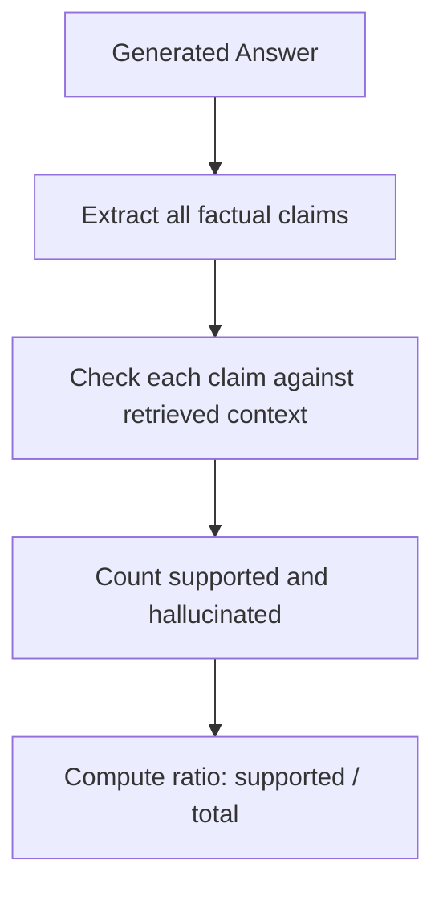

# RAG Answer Evaluation Framework — White Paper

This document explains the evaluation framework for the answers generated by D2D models. It covers the purpose and scoring logic for each metric, formula explanation for complex metrics, real cases from evaluation by golden samples, and a summary table for quick reference.

---

## Evaluation Metrics Overview

We use **five core metrics** to assess the quality of answers generated by a LLM with retrieval (RAG):

1. **Correctness** – Is the answer consistent with the reference (ground truth)?
2. **Faithfulness** – Is the answer fully supported by the retrieved context (avoiding hallucinations)?
3. **Precision** – How much of the answer is actually supported by retrieved chunks?
4. **Recall** – How many facts are covered by the retrieved chunks?
5. **Relevance** – Is the answer relevant to the original guideline question?

---
## 1. Correctness

### Goal:
Evaluate how factually **aligned** the generated answer is with the **reference answer**.

### Logic:
- Score is given on a **1–5 scale**.
- LLM compares the **RAG-generated answer** with the **reference answer** and evaluates factual alignment.

### Use Case:
Evaluates **truthfulness** against known answers.

---

## 2. Faithfulness

### Goal:
Determine whether the answer **hallucinates** or is entirely supported by the retrieved context.

### Logic:

``` ini
faithfulness = # of supported facts in answer / total # of facts in answer
```

- If context is missing → faithfulness = 1.0 with warning: “No context to verify.”
- If both reference and answer are “confused” → judge tone/attitude.
- Score is converted from [0–1] to [1–5] via:  scaled_score = 1 + 4 × raw_score

### Flowchart:


---

## 3. Precision

### Goal:
Assess how much of the answer is actually grounded in retrieved context chunks.

### Logic:

``` ini
precision = # related chunks / total retrieval chunks
```

- Precision is chunk-level: whether what the LLM says appears in any chunk.
- If the answer is indistinct, compare chunks to reference answer.
- If no retrieval context → precision = NaN.

---

## 4. Recall

### Goal:
Check whether the retrieved content contains the information needed to reconstruct the reference answer.

### Logic:

``` ini
recall = # covered facts (i.e.  total facts from retriever ∩ total factors in the generated answer)  / total facts in the generated answer
```

- Recall evaluates retrieval quality: was enough information retrieved?
- If the answer is indistinct, use reference answer instead.
- If no context → recall = 1.0.

---

## 5. Relevance

### Goal:
Determine if the answer is on-topic with the original guideline question.

### Logic:
- Score is given on a **1–5 scale**.
- LLM checks whether the answer addresses the intent of the question.

---

## Summary Table
| Metric      | Goal           | Scale      |  Analogy               |  Weithting  Suggesting |
|-------------|----------------|------------|------------------------|------------------------|
| Correctness | Answer alignment | 1–5       | How many points the student earns by taking an exam with a cheat sheet.  | 0.4 (high)         |
| Faithfulness| Hallucination detection | 0–1 -> 1-5     | Whether the student copied only from the cheat sheet without making things up. | 0.2 (medium)       |
| Precision   | Context relevance | 0–1 -> 1-5     | How much of the cheat sheet content was actually used in the answer. | 0.2 (medium)       |
| Recall      | Information coverage | 0–1 -> 1-5     | Whether the student brought a complete cheat sheet to the test. | 0.2 (medium)       |
| Relevance   | Question alignment | 1–5       | Whether the student answered the question that was actually asked. (For questionaire quality purpose, not model performance)| 0 (low)         |

Note: If both the answer and reference are “confused”, the correctness score should be high because the answers are highly similar. However the relevance score should be low, indicating the answer is not relevant to the question.

---
## 6. Case Study: Metric Demonstration

Let’s consider the following example from the dataset:

**Question:**
> Do you think this kind of technology is exciting or concerning?

**Generated Answer:**
> Game changer for disabilities, but emotionally exhausting.

**Reference Answer (Ground Truth):**
> Mostly exciting, though there are some risks.

**Retrieved Context:**
> chunk 1:
Interviewer: What’s a benefit you can imagine?
Interviewee: For people with disabilities—especially speech disabilities—it could be a game changer. Also might help people with anxiety express themselves more easily.

> chunk 2:
Interviewer: And a possible downside?
Interviewee: Mental fatigue maybe? Or like, accidentally leaking a private thought. I think it could be emotionally exhausting to always filter your own brain.

> chunk 3:
Interviewer: Could this tech exist soon?
Interviewee: I mean, we're not *that* far off. With the pace of brain-computer interface research? It’s coming. So yeah, maybe within our lifetime.

### Metric Breakdown:

| Metric        | Score | Explanation |
|---------------|-------|-------------|
| **Correctness** | 3.0 | The answer overlaps partially with the reference: both acknowledge benefits and risks, but not fully aligned. |
| **Faithfulness** | 5.0 | Total facts: 2 ("Game changer for disabilities" and "emotionally exhausting")<br>Supported facts: 2<br>Hallucinated facts: 0<br>Faithfulness = 2 / 2 = 1 → projected to 5.0 |
| **Precision** | 3.7 | Total chunks: 3<br>Used chunks: chunk 1, chunk 2<br>Unused chunks: chunk 3<br>Precision = 2 / 3 = 0.67 → projected to 3.7 |
| **Recall** | 5.0 | Total facts: 2 ("game changer" for disabilities (chunk 1), and "emotionally exhausting" (chunk 2))<br>Covered facts: 2<br>Uncovered facts: None<br>Recall = 2 / 2 = 1 → projected to 5.0 |
| **Relevance** | 4.0 | The answer is mostly on-topic and addresses the question, though slightly indirect. |
